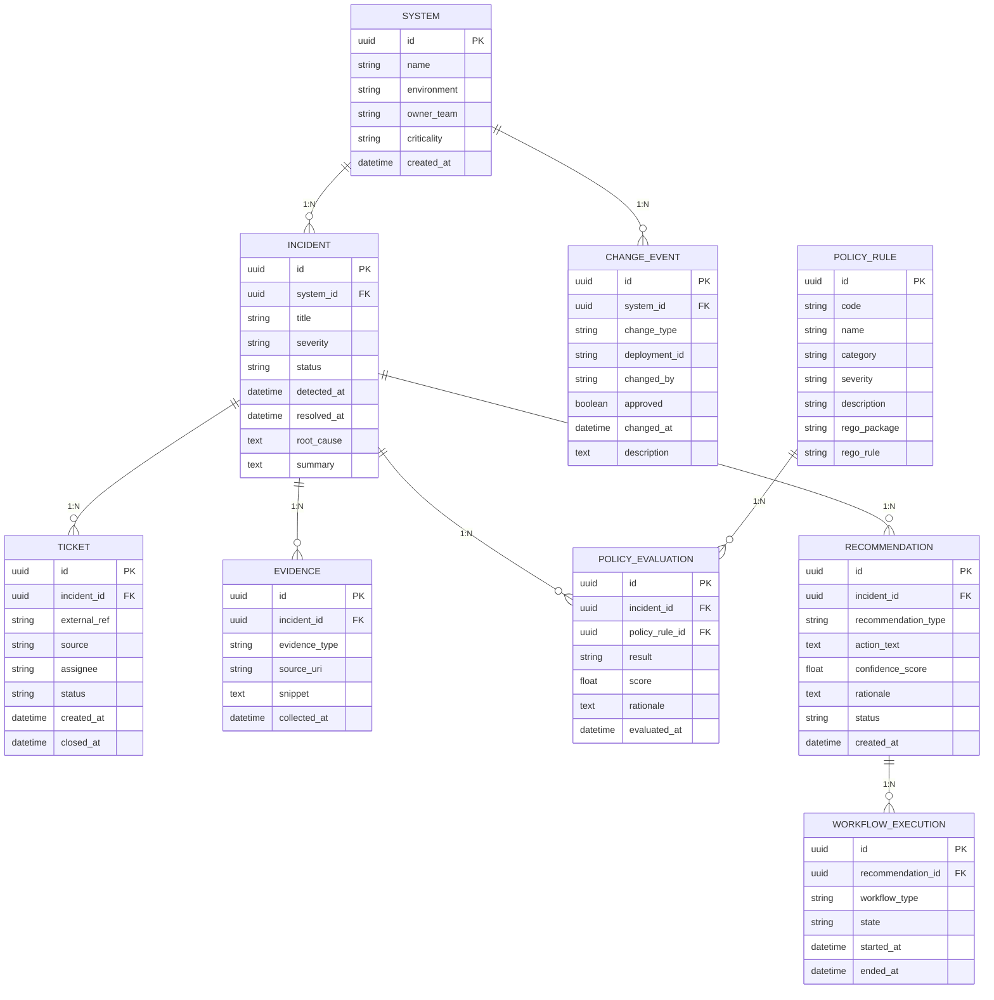

# Entity Relationship Diagram (ERD) - ax-decision-fabric

이 문서는 **ax-decision-fabric** 프로젝트의 핵심 데이터 모델인 **Incident 중심 운영 의사결정 모델**을 정의합니다.

## 1. 설계 의도 (Design Intention)

본 ERD의 핵심은 단순한 운영 데이터의 저장이 아니라, **판단 근거의 연결성(Explainability & Traceability)**에 있습니다.
- "장애가 발생했다"는 사실을 넘어, **어떤 시스템**에서, **어떤 변경**이 원인이 되었는지 탐지합니다.
- **어떤 정책(Policy)**에 의해 리스크가 평가되었으며, 그 결과로 **어떤 권고(Recommendation)**가 생성되었는지 추적합니다.
- 권고가 실제 **워크플로우(Workflow)**로 어떻게 실행되었는지까지의 생명주기를 관리합니다.

---

## 2. ERD 다이어그램 (Mermaid)

---

## 3. 엔티티 상세 정의 (Entity Definitions)

### 3.1 Core Entities
- **System**: 관리 대상 시스템 정보. (Criticality에 따라 정책 평가 가중치 부여 가능)
- **Incident**: 발생한 장애/이벤트의 핵심 객체. 모든 분석의 중심점.

### 3.2 Operational Context
- **Ticket**: 외부 시스템(Jira, ServiceNow 등)과 연동된 티켓 정보.
- **ChangeEvent**: 장애 발생 전후의 시스템 변경 이력 (Code Deploy, Config Change 등).
- **Evidence**: 판단의 근거가 되는 데이터 스니펫 (Log, Metrics, CLI Output 등).

### 3.3 Decision Logic
- **PolicyRule**: OPA(Open Policy Agent) 등에서 활용할 정책 정의.
- **PolicyEvaluation**: 특정 Incident에 대해 PolicyRule이 적용된 결과와 점수.

### 3.4 Outcome & Execution
- **Recommendation**: 분석 결과를 바탕으로 생성된 실행 가능한 권고안.
- **WorkflowExecution**: 권고안에 따라 실행된 실제 워크플로우(Temporal 기반 등)의 상태 기록.

---

## 4. 관계 요약 (Relationship Summary)
- **System 1:N Incident**: 하나의 시스템에서는 여러 장애가 발생할 수 있음.
- **System 1:N ChangeEvent**: 시스템에는 지속적인 변경이 발생함.
- **Incident 1:N Ticket**: 하나의 장애에 대응하기 위해 여러 티켓이 생성될 수 있음.
- **Incident 1:N Evidence**: 증거 자료는 다수가 존재할 수 있음.
- **Incident 1:N PolicyEvaluation**: 장애 하나에 여러 정책이 동시에 평가됨.
- **Incident 1:N Recommendation**: 하나의 장애에 대해 여러 해결 방안이 제시될 수 있음.
- **Recommendation 1:N WorkflowExecution**: 하나의 권고안은 여러 번의 실행 시도를 가질 수 있음.
