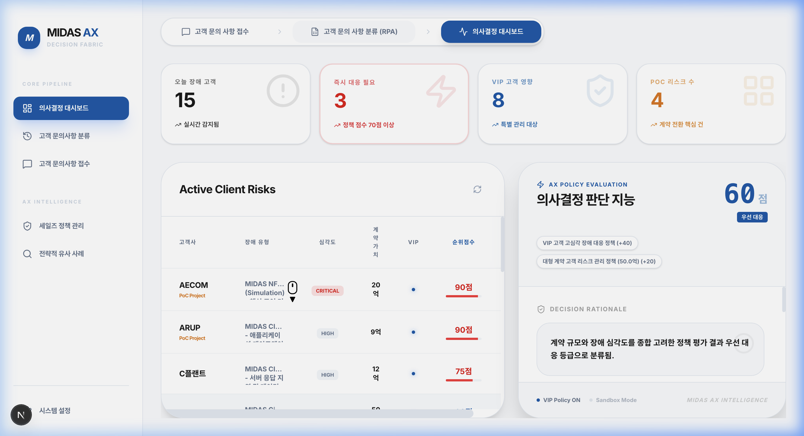
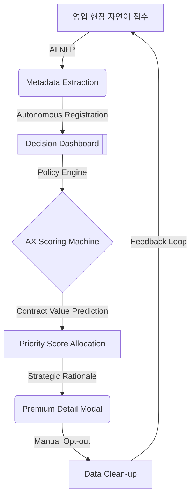

# Midas AX: Sales Decision Intelligence Platform (v1.4) 💎

[](https://glory903-devsecops.github.io/ax-policy-aware-ops/)
[](./assets/ax_pipeline_ux.gif)
[](./LICENSE)

> **"비정형 현장 지식의 지능형 데이터화(AX)를 통한 영업 기회 손실 Zero화"**
> 
> 마이다스아이티(Midas IT)의 DX(Digital Transformation)를 넘어 AX(AI Transformation)로 가는 핵심 전략적 자산입니다. 본 플랫폼은 현장의 비정형 메시지를 지능형 데이터로 변환하고, 기업의 통제된 정책(Policy)에 따라 자원을 최우선 배분하는 **AX Decision Fabric**을 구축합니다.

---

## 📂 Project Vision: Enterprise AX Edition (v1.4)

현대 비즈니스 환경에서 영업 담당자가 수집하는 자연어 데이터는 기업의 가장 소중한 자산입니다. **Midas AX v1.4**는 단순한 데이터 수집을 넘어, AI가 비즈니스 가치를 판단하고 능동적으로 의사결정을 지원하는 **'Autonomous Sales Ops'** 환경을 제공합니다.

### ✨ v1.4 Core Intelligence Features

1.  **AX-First Autonomous Pipeline**: 
    - 자연어 접수 즉시 AI가 메타데이터를 추출하고 대시보드에 자동 등록합니다. 
    - 불필요한 데이터는 사용자가 선택적으로 제외(Opt-out)할 수 있는 하이브리드 통제권을 제공합니다.
2.  **Intelligent Value Prediction (AI 예측)**: 
    - 명시적인 금액 정보가 없는 문의라도 AI가 고객사 규모, VIP 여부, 프로젝트 성격을 분석하여 예상 계약 가치를 산출합니다.
3.  **Enterprise Search & Sorting**: 
    - 수백 개의 고객 문의 중 핵심 리스크를 즉시 찾을 수 있는 전역 검색 및 실시간 컬럼 정렬 기능을 탑재했습니다.
4.  **Premium Detail Viewer (Strategic Report)**: 
    - 정형화된 데이터 뒤에 숨겨진 AI의 전략적 분석 근거(Rationale)를 시각화된 모달 인터페이스로 제공합니다.
5.  **Audit & Compliance**: 
    - ERP 연동 및 보고를 위한 CSV 데이터 내보내기(Export) 기능을 지원하여 데이터 자산화를 돕습니다.
6.  **Backend Status Monitoring**: 
    - 사이드바 내 Swagger/Redocs 통합 링크를 통해 실시간 백엔드 상태와 API 명세를 상시 확인할 수 있습니다.

---

## 🎨 Professional Analytics UI

본 플랫폼은 마이다스아이티의 `Enterprise Pro` 디자인 시스템을 준수하며, 경영진에게는 통찰을, 실무자에게는 효율을 제공합니다.

### 📊 1. AI Decision Dashboard
실시간 리스크 정렬 및 AI가 제안하는 최우선 대응 고객을 다차원(VIP, PoC, 계약가치)으로 관제합니다.


### 🧩 2. Inquiry Management & Extraction
AI가 비정형 텍스트에서 데이터를 자동 추출하고, 전략적 가치를 분석하는 상세 모달을 제공합니다.


---

## 🏗️ System Architecture: The AX Loop



---

## 🚀 Deployment & Demo (시연 가이드)

### 🌐 Live Demo (GitHub Pages)
본 프로젝트는 **High-Fidelity Simulation Engine**을 탑재하고 있어, 백엔드 서버 없이도 실시간 AI 분석 경험을 웹에서 즉시 체험할 수 있습니다.
👉 **[Midas AX 데모 사이트 바로가기](https://glory903-devsecops.github.io/ax-policy-aware-ops/)**

### 💻 Local Setup
```bash
# 1. Backend (FastAPI)
cd backend && pip install -r requirements.txt
python3 -m uvicorn app.main:app --port 8000

# 2. Frontend (Next.js)
cd frontend && npm install && npm run dev
```

---

## 🛠️ Release Journey

- **v1.4 (Current)**: Enterprise Detail Modal, 정렬/검색 고도화, 자동화 파이프라인 완성.
- **v1.3**: AI 예측 엔진 도입 및 CSV 내보내기 구현.
- **v1.0**: 기본 수집-분류-대시보드 파이프라인 구축.

---

## 🏆 Development Team
- **Project Lead**: Glory Lee
- **Specialized in**: Next.js (Frontend), FastAPI (Backend), PostgreSQL, AI Analysis.
- **Design Philosophy**: Midas Blue Branding, Symmetric Grid, Premium Analytics UX.