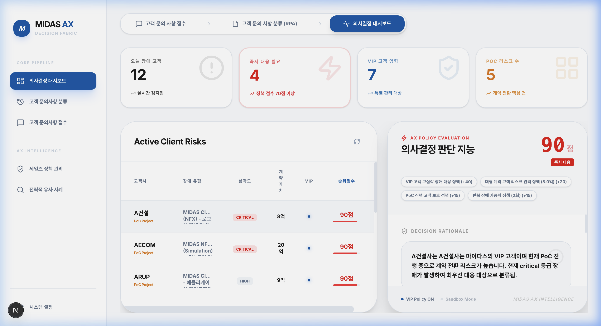
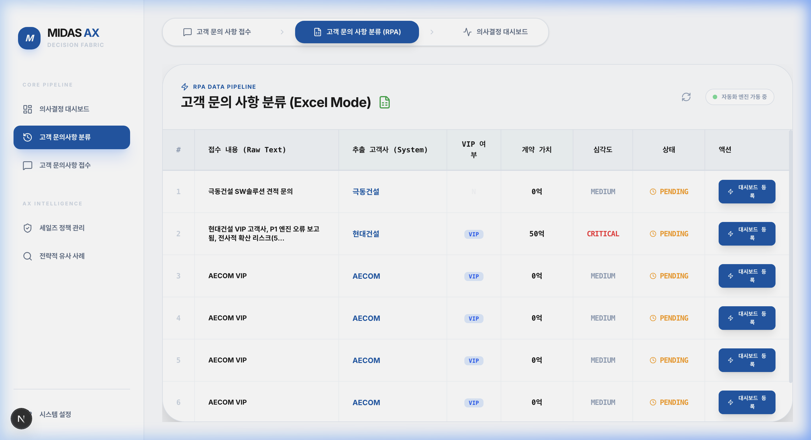
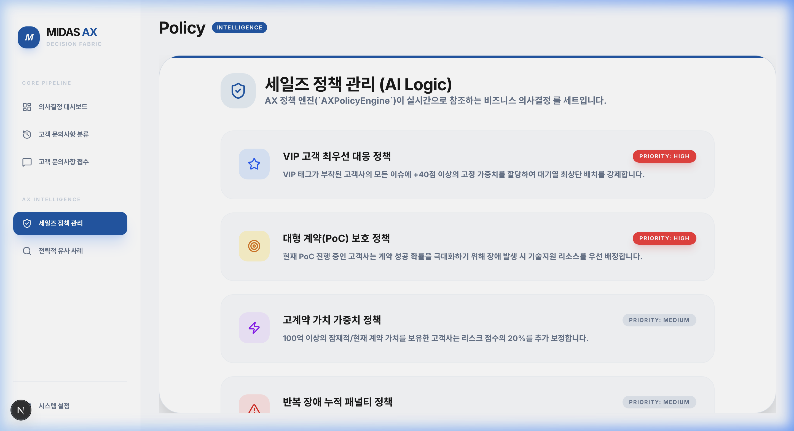
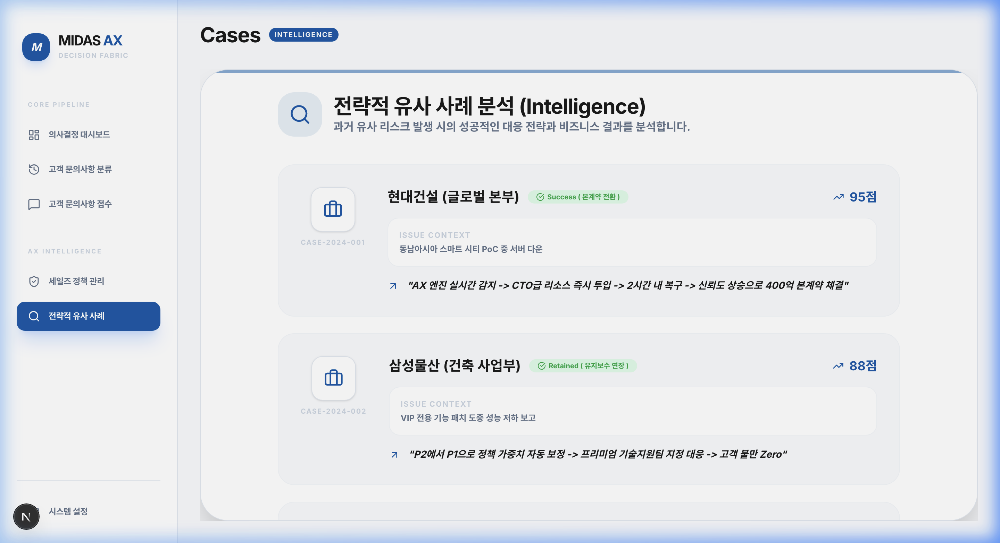
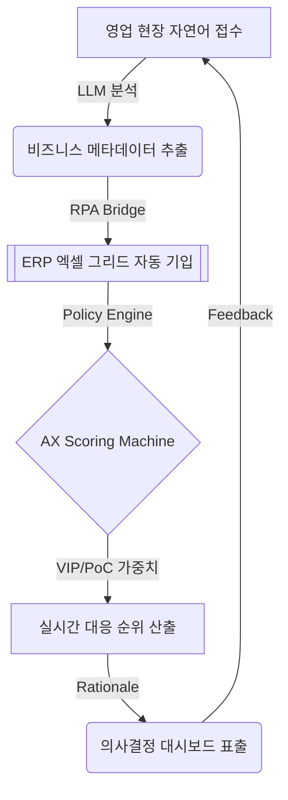

# Midas AX: Sales Decision Intelligence Platform (v1.0) 💎

[](http://localhost:3000)
[](./docs/assets/journey_v4.webp)

> **"비정형 현장 지식의 데이터화(AX)를 통한 영업 기회 손실 Zero화"**
> 
> 마이다스아이티(Midas IT)의 DX(Digital Transformation)를 넘어 AX(AI Transformation)로 가는 핵심 전략적 자산입니다. 본 플랫폼은 현장의 비정형 메시지를 지능형 데이터로 변환하고, 기업의 통제된 정책(Policy)에 따라 자원을 최우선 배분하는 **AX Decision Fabric**을 구축합니다.

---

## 📂 Project Vision & Strategy

현대 비즈니스 환경에서 영업 담당자가 수집하는 자연어 데이터는 기업의 가장 소중한 자산입니다. 하지만 대다수의 기업은 이를 정형화하지 못해 중요한 'VIP 시그널'이나 '대형 계약 리스크'를 놓치고 있습니다.

**Midas AX**는 이 문제를 3단계 지능형 루프로 해결합니다:
1. **Intelligent Reception**: 자연어를 통해 현장 리스크 식별.
2. **RPA Data Fabric**: AI가 비즈니스 맥락을 추출하고 ERP 그리드에 자동 동기화.
3. **Decision Intelligence**: 정책 엔진이 실시간 대응 순위(Scoring)와 근거(Rationale) 제시.

---

## 🎨 Enterprise UI/UX Landscape

본 플랫폼은 마이다스아이티의 `Enterprise Pro` 디자인 시스템을 준수하며, 경영진과 실무자 모두에게 직관적인 인사이트를 제공합니다.

### 📊 1. Decision Intelligence Dashboard
실시간 리스크 현황과 KPI를 관제하며, AI가 제안하는 최우선 대응 고객을 즉시 확인합니다.


### 🧩 2. RPA Classification & Extraction
AI가 비정형 텍스트에서 **VIP 여부, 계약 규모, 심각도**를 자동 추출하여 엑셀 그리드에 기입합니다.


### ⚙️ 3. Sales Policy & Global Intelligence
기업의 비즈니스 룰을 관리하고, 과거 유사 성공 사례를 통해 전략적 대응 방안을 추천받습니다.
| 세일즈 정책 관리 (AI Logic) | 전략적 유사 사례 (Intelligence) |
| :---: | :---: |
|  |  |

---

## 🏗️ System Architecture & Data Flow



---

## 🚀 Quick Start (빠른 시연 가이드)

### 1️⃣ 환경 구축 (Environment Setup)
백엔드와 프론트엔드가 유기적으로 연동되어야 합니다.

**Back-End (FastAPI)**
```bash
# 의존성 설치 및 서버 실행
pip install -r requirements.txt
python3 -m uvicorn app.main:app --host 127.0.0.1 --port 8000
```

**Front-End (Next.js)**
```bash
# 디렉토리 이동 및 실행
cd frontend
npm install
npm run dev
```

### 2️⃣ 시연 시나리오 (Demo Workflow)
1. **[접수]**: 사이드바에서 `고객 문의사항 접수` 클릭 후 **"현대건설 VIP, 50억 PoC 연계 건 장애 보고"** 입력.
2. **[분류]**: `고객 문의사항 분류` 메뉴로 자동 이동되어 데이터가 엑셀 시트에 자동 기입되는 과정 확인.
3. **[결과]**: `의사결정 대시보드`에서 현대건설이 최상단(90점)에 배치되고 판단 근거가 출력되는지 감상.

---

## 🛠️ Versioning Strategy (버전 관리 및 백업)

본 플랫폼은 UI/UX 고도화 시점마다 **Snapshot Tag**를 생성하여 자산을 보존합니다.

- **v1.0-ax-sales-pipeline**: 현장 접수-RPA-대시보드 풀 파이프라인 완성본.
- **향후 계획**: 실시간 LLM API 연동 및 예측 분석 엔진 강화.

```bash
# 현재 시점 백업 명령어
git tag v1.0-ax-stable
git push origin --tags
```

---

## 🏆 기획 및 개발 (Midas IT AX TF)
- **Project lead**: Glory Lee
- **Tech Stack**: Next.js, FastAPI, SQL-Alchemy, Framer-Motion, NLP Engine.